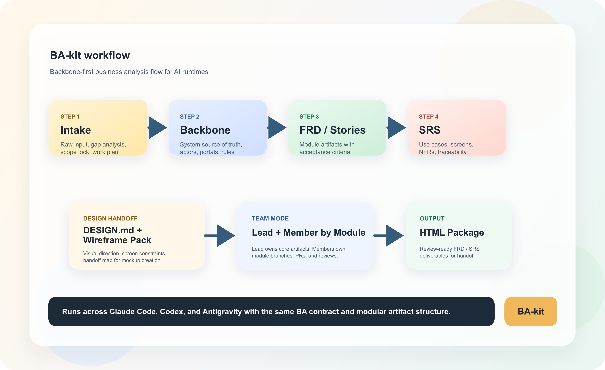

---
layout:
  width: wide
  title:
    visible: false
  description:
    visible: false
  tableOfContents:
    visible: false
  outline:
    visible: false
  pagination:
    visible: false
  metadata:
    visible: false
  tags:
    visible: true
---

# Untitled


{% column width="50%" %}
## BA-Kit

### Business Analysis playbook cho Codex, Claude Code, và Antigravity

Chuẩn hóa intake, backbone, FRD, SRS, wireframe handoff, và package để BA work không còn phụ thuộc vào prompt rời rạc.

<a href="https://app.gitbook.com/o/TKtOEC2zMd0I3J09I2vT/s/HOCjdJGBW9DSSIC0G3Uh/" class="button primary">Documentation</a><a href="https://app.gitbook.com/o/TKtOEC2zMd0I3J09I2vT/s/8tPNnQllfSpR5E7C2BY4/" class="button primary">Changelog</a>


{% column width="50%" %}
<figure><figcaption></figcaption></figure>




Từ raw input đến artifact có thể review, có traceability, và có thể chia theo module cho nhiều BA cùng làm.


### Từ raw input đến artifact có thể review

BA-kit chuẩn hóa workflow BA theo một chuỗi rõ ràng, từ intake đến handoff và package cuối.

<table data-view="cards"><thead><tr><th></th><th></th><th data-hidden data-card-cover data-type="image">Cover image</th></tr></thead><tbody><tr><td>Raw Input</td><td>Business brief, workshop notes, PRD, policy docs, hoặc requirement thô</td><td><a href=".gitbook/assets/01-raw-input.png">01-raw-input.png</a></td></tr><tr><td>Intake</td><td>Chuẩn hóa raw input, gap analysis, và scope lock.</td><td><a href=".gitbook/assets/02-intake.png">02-intake.png</a></td></tr><tr><td>Backbone</td><td>Khóa source of truth ở mức hệ thống trước khi tách module.</td><td><a href=".gitbook/assets/03-backbone.png">03-backbone.png</a></td></tr><tr><td>FRD</td><td>Mô tả functional requirements theo cấu trúc formal.</td><td><a href=".gitbook/assets/04-frd.png">04-frd.png</a></td></tr><tr><td>Stories/SRS</td><td>Tạo user stories, acceptance criteria, use cases, screen behavior, NFR</td><td><a href=".gitbook/assets/05-stories-srs.png">05-stories-srs.png</a></td></tr><tr><td>Wireframe handoff</td><td>Chuẩn bị DESIGN.md, wireframe-input, và wireframe-map.</td><td><a href=".gitbook/assets/06-wireframe-handoff.png">06-wireframe-handoff.png</a></td></tr><tr><td>HTML Package</td><td>Tạo FRD/SRS review-ready để handoff cho stakeholder và team delivery</td><td><a href=".gitbook/assets/07-html-package.png">07-html-package.png</a></td></tr></tbody></table>


Kết quả là team không phải dựng lại framework phân tích cho mỗi dự án, và cũng không bị trôi source of truth giữa nhiều tài liệu.




### Why BA-Kit?



<table data-view="cards"><thead><tr><th></th><th></th><th data-hidden data-card-cover data-type="image">Cover image</th></tr></thead><tbody><tr><td>Backbone-first</td><td>Khóa source of truth sau intake để downstream artifact không trôi nghĩa.</td><td><a href=".gitbook/assets/08-backbone-first.png">08-backbone-first.png</a></td></tr><tr><td>Module-safe</td><td>Nhiều BA có thể làm song song trên nhiều module với branch riêng</td><td><a href=".gitbook/assets/09-module-safe.png">09-module-safe.png</a></td></tr><tr><td>Manual wireframe handoff</td><td>Giữ mockup tách khỏi source of truth nhưng vẫn có handoff pack rõ ràng</td><td><a href=".gitbook/assets/10-manual-handoff.png">10-manual-handoff.png</a></td></tr></tbody></table>



### Choose your runtime

<table data-view="cards"><thead><tr><th></th><th></th><th data-hidden data-card-cover data-type="image">Cover image</th></tr></thead><tbody><tr><td>Claude Code</td><td>Slash-command style với ba-do, ba-start, ba-notion</td><td><a href=".gitbook/assets/11-claude-code.png">11-claude-code.png</a></td></tr><tr><td>CodeX</td><td>Repo-native operating guide qua AGENTS.md và skills/.</td><td><a href=".gitbook/assets/12-codex.png">12-codex.png</a></td></tr><tr><td>Antigravity</td><td>Prompt-based workflow với system context và Knowledge Item.</td><td><a href=".gitbook/assets/13-antigravity.png">13-antigravity.png</a></td></tr></tbody></table>

### Built for BA Lead and BA Member workflows

BA-kit hỗ trợ mô hình làm việc theo module, nơi core artifact được lead khóa trước và module artifact được member triển khai trên branch riêng

* `BA Lead` làm intake, plan, backbone, design direction
* `BA Member` làm artifact theo module
* mỗi module đi trên branch riêng
* mọi thay đổi đi qua Pull Request để lead review

<a href="https://app.gitbook.com/s/HOCjdJGBW9DSSIC0G3Uh/collaboration" class="button primary">See Collaboration Guide</a>

### Output artifacts

* `intake.md`
* `plan.md`
* `backbone.md`
* `frd.md`
* `user-stories.md`
* `srs.md`
* `DESIGN.md`
* `wireframe-input.md`
* `wireframe-map.md`
* `compiled-frd.html`
* `compiled-srs.html`

### Start with Documentation. Use Changelog to track what changed.

Nếu anh muốn hiểu workflow, runtimes, và cách team BA làm việc theo module, hãy bắt đầu từ Documentation. Nếu anh muốn xem thay đổi mới nhất của BA-kit, đi vào Changelog.

<a href="https://app.gitbook.com/o/TKtOEC2zMd0I3J09I2vT/s/HOCjdJGBW9DSSIC0G3Uh/" class="button primary">Open Documentation</a><a href="https://app.gitbook.com/o/TKtOEC2zMd0I3J09I2vT/s/8tPNnQllfSpR5E7C2BY4/" class="button primary">Open Changelog</a>
