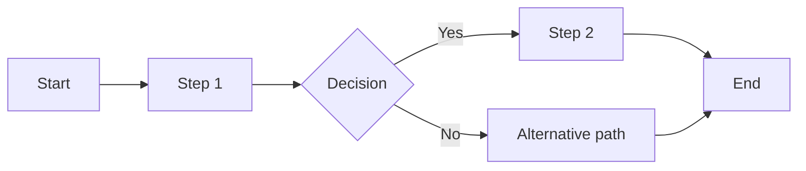

# Functional Requirements Document

**Project:** [Project name]
**Version:** [v1.0]
**Owner:** [BA owner]
**Date:** [YYYY-MM-DD]

## Functional Overview
Describe what the solution must do in business terms.

## User Personas
| Persona | Goals | Pain Points | Success Criteria |
| --- | --- | --- | --- |
| [Persona] | [Goal] | [Pain point] | [Success criteria] |

## Feature List
| Feature | Priority | Description | Owner |
| --- | --- | --- | --- |
| [Feature] | [MoSCoW] | [Description] | [Owner] |

## Workflows
Use Mermaid swimlanes or flowcharts for major user journeys.

## Data Requirements
- Input data:
- Output data:
- Data validation rules:
- Retention needs:

## Business Rules
| Rule ID | Rule | Rationale | Exception |
| --- | --- | --- | --- |
| BR-01 | [Rule] | [Rationale] | [Exception] |

## Performance Requirements
- Response time:
- Volume expectations:
- Availability:

## Integration Points
| System | Purpose | Interface | Dependency |
| --- | --- | --- | --- |
| [System] | [Purpose] | [API/File/Manual] | [Dependency] |

## Acceptance Criteria
- [Criterion]

## Related Templates
- [BRD Template](./brd-template.md)
- [User Story Template](./user-story-template.md)
- [Process Map Template](./process-map-template.md)
