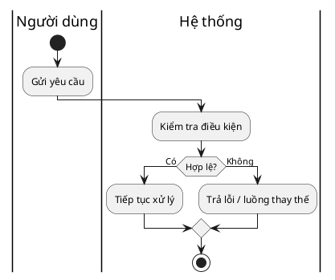

# Tài liệu yêu cầu chức năng (Functional Requirements Document)

**Dự án (Project):** [Tên dự án]
**Phiên bản (Version):** [v1.0]
**Chủ sở hữu (Owner):** [BA owner]
**Ngày (Date):** [YYYY-MM-DD]

## Tổng quan chức năng (Functional Overview)
Mô tả giải pháp cần thực hiện dưới góc độ kinh doanh.

## Chân dung người dùng (User Personas)
| Persona | Mục tiêu (Goals) | Điểm đau (Pain Points) | Tiêu chí thành công (Success Criteria) |
| --- | --- | --- | --- |
| [Persona] | [Mục tiêu] | [Điểm đau] | [Tiêu chí] |

## Danh sách tính năng (Feature List)
| Tính năng (Feature) | Ưu tiên (Priority) | Mô tả (Description) | Chủ sở hữu (Owner) |
| --- | --- | --- | --- |
| [Tính năng] | [MoSCoW] | [Mô tả] | [Owner] |

## Luồng nghiệp vụ (Workflows)
Sử dụng PlantUML activity diagram có swimlane khi cần thể hiện trách nhiệm chéo vai trò/hệ thống. Với luồng đơn giản, có thể dùng Mermaid flowchart.

## Yêu cầu dữ liệu (Data Requirements)
- Dữ liệu đầu vào:
- Dữ liệu đầu ra:
- Quy tắc kiểm tra dữ liệu:
- Yêu cầu lưu trữ:

## Quy tắc nghiệp vụ (Business Rules)
| Mã quy tắc (Rule ID) | Quy tắc (Rule) | Lý do (Rationale) | Ngoại lệ (Exception) |
| --- | --- | --- | --- |
| BR-01 | [Quy tắc] | [Lý do] | [Ngoại lệ] |

## Yêu cầu hiệu năng (Performance Requirements)
- Thời gian phản hồi:
- Khối lượng dự kiến:
- Tính khả dụng:

## Điểm tích hợp (Integration Points)
| Hệ thống (System) | Mục đích (Purpose) | Giao diện (Interface) | Phụ thuộc (Dependency) |
| --- | --- | --- | --- |
| [Hệ thống] | [Mục đích] | [API/File/Manual] | [Phụ thuộc] |

## Tiêu chí chấp nhận (Acceptance Criteria)
- [Tiêu chí]

## Tài liệu liên quan (Related Templates)
- [FRD Template](./frd-template.md)
- [SRS Template](./srs-template.md)
- [User Story Template](./user-story-template.md)
- [Intake Form Template](./intake-form-template.md)
