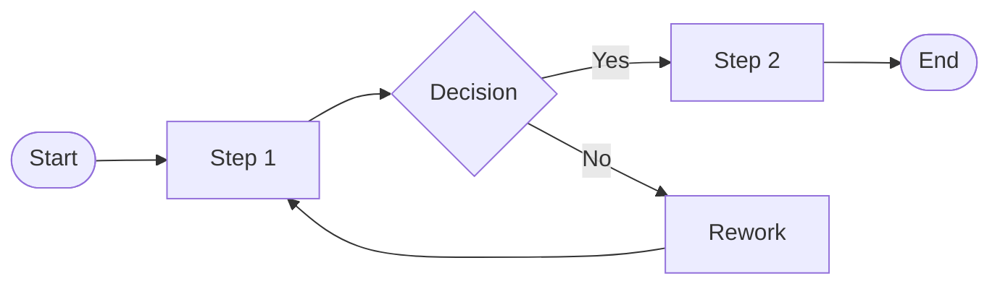
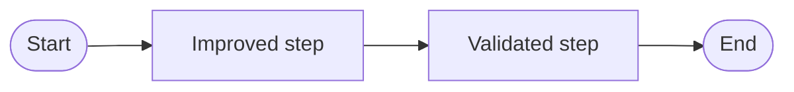
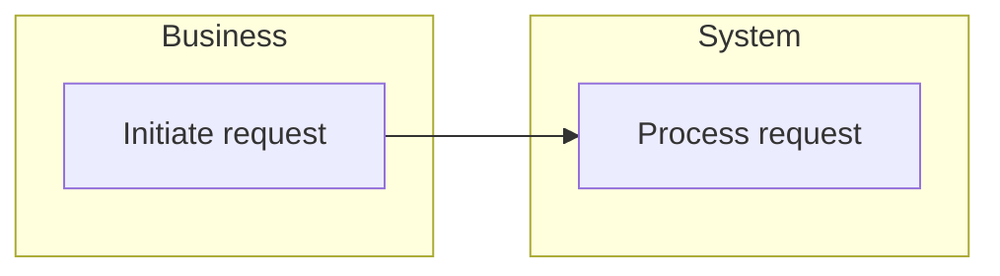

# Process Map Template

**Process Name:** [Name]
**Owner:** [Owner]
**Date:** [YYYY-MM-DD]

## Metadata
- Trigger:
- Frequency:
- SLA:
- Participants:

## Current State
Describe the AS-IS process at a high level.

## Future State
Describe the TO-BE process and improvements.

## Swimlane Example

## Bottlenecks
| Step | Issue | Impact | Recommendation |
| --- | --- | --- | --- |
| [Step] | [Issue] | [Impact] | [Recommendation] |

## Related Templates
- [FRD Template](./frd-template.md)
- [Gap Analysis Template](./gap-analysis-template.md)
- [Stakeholder Register Template](./stakeholder-register-template.md)
