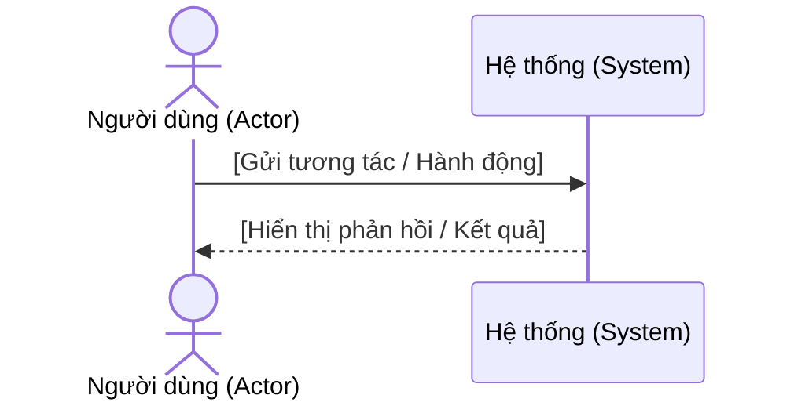
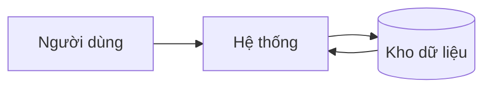
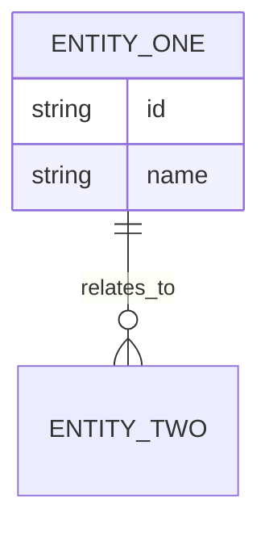

# Đặc tả yêu cầu phần mềm (Software Requirements Specification)

**Dự án (Project):** [Tên dự án]
**Phiên bản (Version):** [v1.0]
**Chủ sở hữu (Owner):** [BA/technical owner]
**Ngày (Date):** [YYYY-MM-DD]

## Mục đích và phạm vi (Purpose and Scope)
Nêu phạm vi phần mềm, ranh giới hệ thống, và đối tượng đọc.

## Mô tả tổng quan (Overall Description)
- Góc nhìn sản phẩm:
- Nhóm người dùng:
- Môi trường vận hành:
- Giả định và phụ thuộc:

## Kiến trúc hệ thống & Điều hướng (Information Architecture)
Liệt kê các Portal/App trong hệ thống, đối tượng mục tiêu, và cấu trúc Menu (Sitemap) tương ứng để đảm bảo sự nhất quán trong thiết kế UI/UX và phân quyền.

| Portal / App | Đối tượng mục tiêu (Target Actor) | Menu chính (Sitemap) | Pattern điều hướng |
| --- | --- | --- | --- |
| [Admin Portal] | [System Admin] | - Dashboard<br>- Quản lý người dùng<br>- Cài đặt | [Sidebar] |
| [Customer App] | [Khách hàng] | - Home<br>- Đơn hàng<br>- Tài khoản | [Bottom tabs] |

## Yêu cầu chức năng (Functional Requirements)
| Mã (ID) | Yêu cầu (Requirement) | Ưu tiên (Priority) | Nguồn (Source) | Tiêu chí chấp nhận (Acceptance Criteria) |
| --- | --- | --- | --- | --- |
| FR-01 | [Yêu cầu] | [Must/Should/Could] | [Nguồn] | [AC] |

## Đặc tả Use Case (Use Case Specifications)
Mô tả các tương tác chính của hệ thống theo định dạng actor-goal. Mỗi dòng một use case, sau đó mở rộng các use case quan trọng bên dưới.

| Mã UC (Use Case ID) | Tên UC (Use Case Name) | Tác nhân chính (Primary Actor) | Trigger | Điều kiện tiên quyết (Precondition) | Hậu điều kiện (Postcondition) |
| --- | --- | --- | --- | --- | --- |
| UC-01 | [Use case] | [Tác nhân] | [Trigger] | [Điều kiện tiên quyết] | [Hậu điều kiện] |

### Use Case chi tiết (Detailed Use Case)
**Mã UC (Use Case ID):** [UC-01]
**Mục tiêu (Goal):** [Tác nhân đạt được gì]
**Tác nhân chính (Primary Actor):** [Tác nhân]
**Tác nhân/Hệ thống hỗ trợ (Supporting Actors/Systems):** [Tùy chọn]
**Điều kiện tiên quyết (Preconditions):** [Điều kiện phải đúng trước đó]
**Hậu điều kiện (Postconditions):** [Điều kiện đúng sau khi hoàn tất]
**User Stories liên kết (Linked User Stories):** [US-001, US-002]

| Bước (Step) | Hành động tác nhân (Actor Action) | Phản hồi hệ thống (System Response) |
| --- | --- | --- |
| 1 | [Hành động] | [Phản hồi] |

**Luồng thay thế (Alternate Flows)**
- [Biến thể hoặc ngoại lệ]

**Quy tắc nghiệp vụ (Business Rules)**
- [Tham chiếu quy tắc]

**Sơ đồ luồng (Process Flow / Sequence Diagram)**
Yêu cầu bắt buộc phải có sơ đồ luồng BPMN 2.0 (có swimlane bằng Mermaid flowchart/state diagram) hoặc Sơ đồ trình tự (Sequence Diagram) cho Use Case này. Thể hiện rõ các tương tác giữa tác nhân và hệ thống, cũng như các rẽ nhánh luồng thay thế.



**Màn hình liên kết (Linked Screen):** [SCR-01 — Tên màn hình]

**Ghi chú chấp nhận (Acceptance Notes)**
- [Điều cần kiểm tra]

> **Quy tắc nhất quán:** Hành động tác nhân trong use case này phải khớp với User Actions của màn hình tương ứng. Phản hồi hệ thống phải khớp với Behaviour Rules của các trường trên màn hình. Nếu use case nói "hệ thống kiểm tra định dạng email", trường email trên màn hình liên kết phải có Validation Rule tương ứng.

## Hợp đồng màn hình rút gọn (Screen Contract Lite)
Ghi nhận hợp đồng màn hình tối thiểu cần thiết để tạo wireframe trước khi viết mô tả màn hình chi tiết.

| Mã (Screen ID) | Tên (Screen Name) | Phân loại (Classification) | Màn hình cha (Parent Screen) | UC liên kết (Linked Use Cases) | Vào / Ra (Entry / Exit) | Hành động chính (Key Actions) | Trạng thái bắt buộc (Required States) | Mức tài liệu (Documentation Level) |
| --- | --- | --- | --- | --- | --- | --- | --- | --- |
| SCR-01 | [Màn hình] | Primary screen | [N/A] | [UC-01, UC-02] | [Vào / Ra] | [Submit, Cancel] | [Loading, Empty, Error, Success] | Detailed |
| SCR-02 | [Modal / Drawer / Dialog] | Primary screen | [SCR-01] | [UC-03] | [Mở từ SCR-01 / trở về SCR-01] | [Confirm, Close] | [Default, Loading, Error] | Detailed |

> Phần này là hợp đồng đầu vào cho wireframe. Đủ để UI/UX agent tạo low-fidelity frames trước khi mô tả màn hình chi tiết được mở rộng.

## Danh mục màn hình (Screen Inventory)
Ghi nhận mọi UI frame phải tồn tại trong bộ Cloud Screen (Stitch MCP), bao gồm cả màn hình chính và frame trạng thái hỗ trợ.

| Mã (Screen/Frame ID) | Tên (Screen Name) | Phân loại (Classification) | Màn hình cha (Parent Screen) | Mục đích (Purpose) | Mức tài liệu (Documentation Level) |
| --- | --- | --- | --- | --- | --- |
| SCR-01 | [Màn hình] | Primary screen | [N/A] | [Mục đích] | Detailed |
| SCR-02 | [Modal / Drawer / Dialog] | Primary screen | [SCR-01] | [Quyết định quan trọng, xác nhận, hoặc bước form ảnh hưởng luồng] | Detailed |
| SCR-01-EMPTY | [Trạng thái rỗng] | Supporting state | [SCR-01] | [Không có dữ liệu / không có kết quả / hướng dẫn lần đầu] | Inventory-only |
| SCR-01-ERROR | [Trạng thái lỗi] | Supporting state | [SCR-01] | [Lỗi inline / lỗi chặn / trạng thái thử lại] | Inventory-only |
| SCR-01-TOAST-SUCCESS | [Toast thành công] | Supporting feedback | [SCR-01] | [Xác nhận thành công sau hành động chính] | Inventory-only |

> Mọi modal, dialog, drawer, wizard step, hoặc overlay có display rules, behaviour rules, user actions, hoặc ảnh hưởng luồng riêng đều phải được coi là primary screen và có mục mô tả chi tiết riêng.
> Supporting frames không bắt buộc phải có mục chi tiết đầy đủ trong SRS HTML cuối cùng. Chúng vẫn phải tồn tại trong project Stitch và được liệt kê ở đây để đảm bảo truy vết bằng Screen ID.

## Mô tả màn hình (Screen Descriptions)
Viết mục chi tiết màn hình đầy đủ sau khi có wireframe. Sử dụng use cases, Screen Contract Lite, và wireframe đã tạo cùng nhau để hoàn thiện hành vi màn hình. Mọi primary screen, bao gồm modal hoặc overlay ảnh hưởng luồng người dùng, đều phải có mục chi tiết đầy đủ. Sử dụng liệt kê inventory-only cho supporting frames trừ khi chúng cần tài liệu hành vi độc lập.

### Chi tiết màn hình (Screen Detail)
**Mã màn hình (Screen ID):** [SCR-01]
**Stitch Project ID:** [ID của project trên Stitch]
**Stitch Screen ID:** [ID của màn hình sau khi generate]
**Phạm vi artifact (Artifact Scope):** [Single screen / multi-screen flow / module pack]
**Frame hỗ trợ (Supporting Frames):** [SCR-01-EMPTY - Trạng thái rỗng, SCR-01-ERROR - Lỗi inline, SCR-01-TOAST-SUCCESS - Toast thành công]
**Tóm tắt bố cục (Layout Summary):** [Các vùng, panel, hoặc section chính]
**Quy tắc điều hướng (Navigation Rules):** [Menu, breadcrumbs, modal, hành vi back/next]
**UC liên kết (Linked Use Cases):** [UC-01, UC-02]
**User Stories liên kết (Linked User Stories):** [US-001, US-002]

> **Quy tắc nhất quán:** Màn hình này phải triển khai đúng các tương tác mô tả trong use cases liên kết. Tên trường, nhãn hành động, và trình tự luồng phải khớp giữa các bước UC và trường/hành động trên màn hình. Màn hình Stitch được generate phải phản ánh bảng trường và bố cục của màn hình này.
>
> Supporting frames liệt kê ở trên cũng phải tham chiếu đúng bằng Stitch Screen ID khi chúng được ngụ ý bởi trạng thái, validation rules, hành vi bảng/danh sách, hoặc feedback patterns của màn hình.

## Tham chiếu Wireframe / Mockup (Wireframe / Mockup Reference)
- Stitch Project ID: [ID]
- Stitch Screen ID: [ID]
- Ảnh xuất: `designs/[initiative-slug]/exports/[artifact-name]/SCR-01-[screen-name].png`
- File JSON trạng thái: `designs/[initiative-slug]/stitch-state.json`
- Cập nhật lần cuối: [YYYY-MM-DD]

> Một Project ID trên Stitch có thể chứa nhiều Screen ID. Mỗi màn hình SRS phải lưu đúng cấu trúc ID của nó.

> Trong bản xuất HTML cuối cùng, ảnh PNG bên dưới được nhúng inline tự động.


## Ý đồ Wireframe (Wireframe Intent)
Giải thích wireframe đang tối ưu cho điều gì: tốc độ nhập dữ liệu, hoàn thành có hướng dẫn, xem lại trước khi gửi, hoặc quét dashboard.

## Vùng màn hình (Screen Regions)
| Vùng (Region) | Mục đích (Purpose) | Nội dung (Contents) |
| --- | --- | --- |
| Header | [Mục đích] | [Tiêu đề, breadcrumb, trạng thái] |
| Nội dung chính (Main Content) | [Mục đích] | [Form, bảng, panel chi tiết] |
| Vùng hành động (Action Area) | [Mục đích] | [Hành động chính và phụ] |

## Quy tắc dùng chung (Common Rules)
Dùng phần này để gom các quy tắc lặp lại giữa nhiều màn hình hoặc nhiều trường. Trong mô tả màn hình, tham chiếu bằng `Rule Code` thay vì copy lại nguyên văn khi nội dung giống nhau.

**Convention mã quy tắc (Rule Code Convention)**
- Dùng định dạng `CR-{TYPE}-{NN}`.
- `TYPE` dùng một trong các mã: `DIS` (Display), `BEH` (Behaviour), `VAL` (Validation), `MIX` (Mixed rule).
- `NN` là số thứ tự 2 chữ số trong phạm vi tài liệu SRS, ví dụ `01`, `02`, `03`.
- Giữ một mã cho một quy tắc dùng chung ổn định; không tạo mã mới nếu chỉ thay đổi màn hình tham chiếu.

| Mã quy tắc (Rule Code) | Tên quy tắc (Rule Name) | Loại (Type) | Phạm vi áp dụng (Scope) | Nội dung quy tắc (Rule Detail) | Màn hình tham chiếu (Referenced Screens) |
| --- | --- | --- | --- | --- | --- |
| CR-DIS-01 | [Tên quy tắc hiển thị] | Display | [Toàn hệ thống / Module / Nhiều màn hình] | [Mô tả quy tắc dùng chung] | [SCR-01, SCR-02] |
| CR-BEH-01 | [Tên quy tắc hành vi] | Behaviour | [Toàn hệ thống / Module / Nhiều màn hình] | [Mô tả quy tắc dùng chung] | [SCR-03] |
| CR-VAL-01 | [Tên quy tắc validate] | Validation | [Toàn hệ thống / Module / Nhiều màn hình] | [Mô tả quy tắc dùng chung] | [SCR-01, SCR-04] |
| CR-MIX-01 | [Tên quy tắc hỗn hợp] | Mixed | [Toàn hệ thống / Module / Nhiều màn hình] | [Quy tắc bao trùm nhiều loại: hiển thị + hành vi + validate] | [SCR-02, SCR-05] |

## Danh sách thông điệp (Message List)
Dùng phần này để chuẩn hóa error message, warning, success message, banner, toast, và inline message. Trong mô tả màn hình hoặc field, tham chiếu bằng `Message Code`.

**Convention mã thông điệp (Message Code Convention)**
- Dùng định dạng `MSG-{TYPE}-{NN}`.
- `TYPE` dùng một trong các mã: `ERR` (Error), `WRN` (Warning), `SUC` (Success), `INF` (Info).
- `NN` là số thứ tự 2 chữ số trong phạm vi tài liệu SRS, ví dụ `01`, `02`, `03`.
- Một thông điệp chuẩn dùng chung chỉ nên có một mã duy nhất, ngay cả khi xuất hiện ở nhiều màn hình hoặc nhiều field.

| Mã thông điệp (Message Code) | Loại (Type) | Bề mặt hiển thị (Surface) | Trigger / Điều kiện kích hoạt | Nội dung thông điệp (Message Text) | Ghi chú |
| --- | --- | --- | --- | --- | --- |
| MSG-ERR-01 | Error | [Inline / Toast / Banner / Modal] | [Khi nào hiển thị] | [Nội dung hiển thị cho người dùng] | [Ghi chú] |
| MSG-WRN-01 | Warning | [Inline / Toast / Banner / Modal] | [Khi nào hiển thị] | [Nội dung hiển thị cho người dùng] | [Ghi chú] |
| MSG-SUC-01 | Success | [Inline / Toast / Banner / Modal] | [Khi nào hiển thị] | [Nội dung hiển thị cho người dùng] | [Ghi chú] |
| MSG-INF-01 | Info | [Inline / Toast / Banner / Modal] | [Khi nào hiển thị] | [Nội dung hiển thị cho người dùng] | [Ghi chú] |

## Wireframe Low-Fidelity (Low-Fidelity Wireframe)
Sử dụng màn hình được tạo từ Stitch (qua ID và PNG xuất) làm wireframe chính. Thêm bản phác thảo text ở đây chỉ khi cải thiện rõ ràng cho reviewer đọc markdown riêng.

```text
+--------------------------------------------------+
| Header: Tiêu đề / Breadcrumb / Trạng thái        |
+----------------------+---------------------------+
| Panel trái           | Nội dung chính            |
| Điều hướng / Bộ lọc  | Trường form / bảng        |
|                      |                           |
|                      | [Hành động chính] [Hủy]   |
+----------------------+---------------------------+
| Footer / Trợ giúp / Thông tin kiểm toán          |
+--------------------------------------------------+
```

| Tên trường (Field Name) | Loại trường (Field Type) | Mô tả (Description) |
| --- | --- | --- |
| [Tên trường] | [Text / Dropdown / Date Picker / Checkbox / Button / Table / etc.] | **Display Rules:** [Mô tả cách field hiển thị: label, placeholder, visibility, giá trị mặc định, điều kiện read-only, định dạng, helper text nếu có] |
| | | **Behaviour Rules:** [Mô tả cách field tương tác: on-click, on-change, auto-fill, cascading, enable/disable field khác, điều hướng sang màn hình hoặc modal nào] |
| | | **Validation Rules:** [Mô tả rõ required, format, range, cross-field validation, cách hiển thị lỗi (inline / toast / banner), message code hoặc message text cụ thể] |
| | | **Rule Codes:** [CR-DIS-01, CR-VAL-01] |
| | | **Message Codes:** [MSG-ERR-01, MSG-INF-01] |

> Nếu một quy tắc hoặc thông điệp lặp lại ở nhiều màn hình, ưu tiên tham chiếu `Rule Code` và `Message Code` từ phần dùng chung thay vì mô tả lại nguyên văn. Chỉ viết lại đầy đủ ở cấp field khi có ngoại lệ hoặc override riêng cho màn hình đó.

**Hành động người dùng (User Actions)**
- [Hành động chính và hành vi]
- [Hành động phụ và hành vi]

**Trạng thái (States)**
- Loading: [Trạng thái UI mong đợi]
- Rỗng (Empty): [Trạng thái UI mong đợi]
- Không có kết quả (No results): [Trạng thái UI khi bộ lọc hoặc tìm kiếm không trả kết quả]
- Thành công (Success): [Trạng thái UI mong đợi]
- Lỗi (Error): [Trạng thái UI mong đợi]
- Toast / banner / inline message: [Bề mặt phản hồi và điều kiện kích hoạt]
- Vô hiệu/Chỉ đọc (Disabled/Read-only): [Trạng thái UI mong đợi]

**Quy tắc phân quyền và hiển thị (Permission and Visibility Rules)**
- [Vai trò nào có thể xem hoặc thao tác trên control nào]

**Rule Codes sử dụng trong màn hình này (Applied Rule Codes)**
- [CR-DIS-01]
- [CR-BEH-01]
- [CR-VAL-01]

**Message Codes sử dụng trong màn hình này (Applied Message Codes)**
- [MSG-ERR-01]
- [MSG-SUC-01]

**Liên kết User Stories / Use Cases / Requirements**
- User stories: [US-001, US-002]
- Use cases: [UC-01, UC-02]
- Requirements: [FR-01, FR-02, BR-01]

## Yêu cầu phi chức năng (Non-Functional Requirements)
| Mã (ID) | Danh mục (Category) | Yêu cầu (Requirement) | Mục tiêu (Target) |
| --- | --- | --- | --- |
| NFR-01 | Hiệu năng (Performance) | [Yêu cầu] | [Mục tiêu] |

## Sơ đồ luồng dữ liệu (Data Flow Diagrams)


## Sơ đồ thực thể quan hệ (Entity Relationship Diagram)


## Đặc tả API (API Specifications)
- Endpoint:
- Method:
- Request schema:
- Response schema:
- Xử lý lỗi:

## Ràng buộc (Constraints)
- Ràng buộc kỹ thuật:
- Ràng buộc pháp lý:
- Ràng buộc vận hành:

## Kịch bản kiểm thử (Test Cases)
| Mã (ID) | Kịch bản (Scenario) | Kết quả mong đợi (Expected Result) | Ưu tiên (Priority) |
| --- | --- | --- | --- |
| TC-01 | [Kịch bản] | [Kết quả mong đợi] | [Ưu tiên] |

## Bảng thuật ngữ (Glossary)
| Thuật ngữ (Term) | Định nghĩa (Definition) |
| --- | --- |
| [Thuật ngữ] | [Định nghĩa] |

## Tài liệu liên quan (Related Templates)
- [FRD Template](./frd-template.md)
- [User Story Template](./user-story-template.md)
- [Intake Form Template](./intake-form-template.md)
