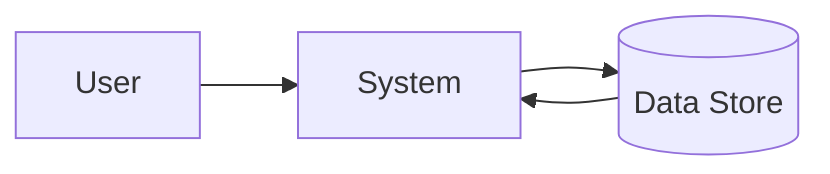
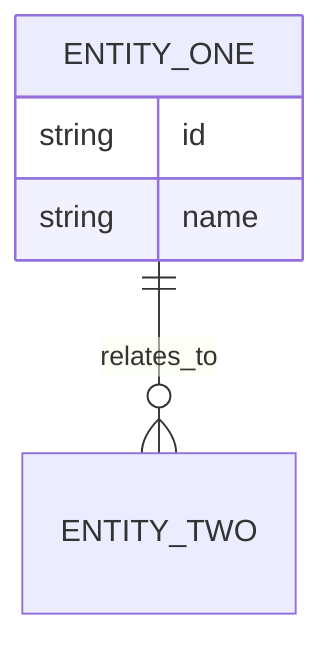

# Software Requirements Specification

**Project:** [Project name]
**Version:** [v1.0]
**Owner:** [BA/technical owner]
**Date:** [YYYY-MM-DD]

## Purpose and Scope
State the software scope, boundaries, and intended readers.

## Overall Description
- Product perspective:
- User classes:
- Operating environment:
- Assumptions and dependencies:

## Functional Requirements
| ID | Requirement | Priority | Source | Acceptance Criteria |
| --- | --- | --- | --- | --- |
| FR-01 | [Requirement] | [Must/Should/Could] | [Source] | [AC] |

## Non-Functional Requirements
| ID | Category | Requirement | Target |
| --- | --- | --- | --- |
| NFR-01 | Performance | [Requirement] | [Target] |

## Data Flow Diagrams

## Entity Relationship Diagram

## API Specifications
- Endpoint:
- Method:
- Request schema:
- Response schema:
- Error handling:

## Constraints
- Technical constraints:
- Regulatory constraints:
- Operational constraints:

## Test Cases
| ID | Scenario | Expected Result | Priority |
| --- | --- | --- | --- |
| TC-01 | [Scenario] | [Expected result] | [Priority] |

## Glossary
| Term | Definition |
| --- | --- |
| [Term] | [Definition] |

## Related Templates
- [FRD Template](./frd-template.md)
- [Gap Analysis Template](./gap-analysis-template.md)
- [Change Impact Template](./change-impact-template.md)
