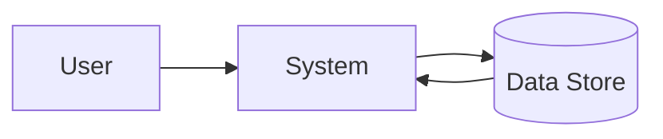
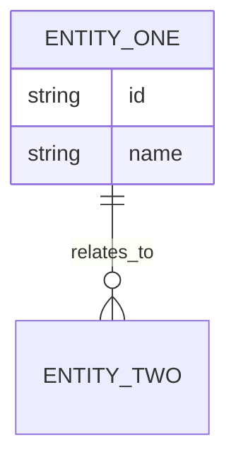

# Software Requirements Specification

**Project:** [Project name]
**Version:** [v1.0]
**Owner:** [BA/technical owner]
**Date:** [YYYY-MM-DD]

## Purpose and Scope
State the software scope, boundaries, and intended readers.

## Overall Description
- Product perspective:
- User classes:
- Operating environment:
- Assumptions and dependencies:

## Functional Requirements
| ID | Requirement | Priority | Source | Acceptance Criteria |
| --- | --- | --- | --- | --- |
| FR-01 | [Requirement] | [Must/Should/Could] | [Source] | [AC] |

## Use Case Specifications
Document the main system interactions in actor-goal format. One row per use case, then expand critical use cases below.

| Use Case ID | Use Case Name | Primary Actor | Trigger | Precondition | Postcondition |
| --- | --- | --- | --- | --- | --- |
| UC-01 | [Use case] | [Actor] | [Trigger] | [Precondition] | [Postcondition] |

### Detailed Use Case
**Use Case ID:** [UC-01]
**Goal:** [What the actor achieves]
**Primary Actor:** [Actor]
**Supporting Actors/Systems:** [Optional]
**Preconditions:** [What must already be true]
**Postconditions:** [What is true after completion]
**Linked User Stories:** [US-001, US-002]

| Step | Actor Action | System Response |
| --- | --- | --- |
| 1 | [Actor action] | [System response] |

**Alternate Flows**
- [Variation or exception]

**Business Rules**
- [Rule reference]

**Linked Screen:** [SCR-01 — Screen Name]

**Acceptance Notes**
- [What must be validated]

> **Consistency rule:** Actor actions in this use case must match the corresponding screen's User Actions. System responses must match the screen's field Behaviour Rules. If the use case says "system validates email format", the linked screen's email field must have a matching Validation Rule.

## Screen Contract Lite
Capture the minimum screen contract needed to generate wireframes before the final screen descriptions are written.

| Screen ID | Screen Name | Classification | Parent Screen | Linked Use Cases | Entry / Exit | Key Actions | Required States | Documentation Level |
| --- | --- | --- | --- | --- | --- | --- | --- | --- |
| SCR-01 | [Screen] | Primary screen | [N/A] | [UC-01, UC-02] | [Entry / Exit] | [Submit, Cancel] | [Loading, Empty, Error, Success] | Detailed |
| SCR-02 | [Confirmation Modal / Drawer / Dialog] | Primary screen | [SCR-01] | [UC-03] | [Opens from SCR-01 / returns to SCR-01] | [Confirm, Close] | [Default, Loading, Error] | Detailed |

> This section is the wireframe input contract. It should be sufficient for the UI/UX agent to generate low-fidelity frames before the final screen descriptions are expanded.

## Screen Inventory
Capture every UI frame that must exist in the Pencil artifact set, including both primary screens and supporting state frames.

| Screen/Frame ID | Screen Name | Classification | Parent Screen | Purpose | Documentation Level |
| --- | --- | --- | --- | --- | --- |
| SCR-01 | [Screen] | Primary screen | [N/A] | [Purpose] | Detailed |
| SCR-02 | [Confirmation Modal / Drawer / Dialog] | Primary screen | [SCR-01] | [Critical decision, confirmation, or form step that affects flow] | Detailed |
| SCR-01-EMPTY | [Screen Empty State] | Supporting state | [SCR-01] | [No data / no results / first-use guidance] | Inventory-only |
| SCR-01-ERROR | [Screen Error State] | Supporting state | [SCR-01] | [Inline validation / blocking error / retry state] | Inventory-only |
| SCR-01-TOAST-SUCCESS | [Screen Success Toast] | Supporting feedback | [SCR-01] | [Success confirmation after primary action] | Inventory-only |

> Any modal, dialog, drawer, wizard step, or overlay that has its own display rules, behaviour rules, user actions, or flow impact should be treated as a primary screen and receive its own detailed screen section.
>
> Supporting frames do not always need full screen detail sections in the final SRS HTML. They must still exist in the Pencil `.pen` file and be listed here for traceability.

## Screen Descriptions
Write full screen detail sections after wireframes are available. Use the use cases, Screen Contract Lite, and generated wireframes together to finalize the screen behavior. Every primary screen, including modal or overlay screens that affect user flow, should have a full screen detail section. Use inventory-only listing for supporting frames unless they need standalone behavioral documentation.

### Screen Detail
**Screen ID:** [SCR-01]
**Pencil Artifact:** `designs/[initiative-slug]/[artifact-name].pen`
**Pencil Frame:** [SCR-01 - Screen Name]
**Artifact Scope:** [Single screen / multi-screen flow / module pack]
**Supporting Frames:** [SCR-01-EMPTY - Empty State, SCR-01-ERROR - Inline Validation, SCR-01-TOAST-SUCCESS - Success Toast]
**Layout Summary:** [Key regions, panels, or sections]
**Navigation Rules:** [Menu, breadcrumbs, modal, back/next behavior]
**Linked Use Cases:** [UC-01, UC-02]
**Linked User Stories:** [US-001, US-002]

> **Consistency rule:** This screen must implement the exact interactions described in its linked use cases. Field names, action labels, and flow sequences must match between UC steps and screen fields/actions. The referenced Pencil frame inside the artifact must reflect this screen's field table and layout.
>
> Supporting frames listed above must also be present in the same or linked Pencil artifact when they are implied by the screen's states, validation rules, table/list behavior, or user feedback patterns.

## Wireframe / Mockup Reference
- Pencil file: `designs/[initiative-slug]/[artifact-name].pen`
- Target frame: [SCR-01 - Screen Name]
- Exported image: `designs/[initiative-slug]/exports/[artifact-name]/SCR-01-[screen-name].png`
- Covered screen IDs in artifact: [SCR-01, SCR-02]
- Last updated: [YYYY-MM-DD]

> A single `.pen` artifact may contain multiple frames. Each SRS screen must point to the exact frame that represents it.

> In the final HTML export, the PNG image below is embedded inline automatically.


## Wireframe Intent
Explain what the wireframe is optimizing for, such as data entry speed, guided completion, review-before-submit, or dashboard scanning.

## Screen Regions
| Region | Purpose | Contents |
| --- | --- | --- |
| Header | [Purpose] | [Title, breadcrumb, status] |
| Main Content | [Purpose] | [Form, table, detail panel] |
| Action Area | [Purpose] | [Primary and secondary actions] |

## Low-Fidelity Wireframe
Use the referenced frame inside the Pencil `.pen` artifact as the primary wireframe. Add a lightweight text sketch here only when it improves clarity for reviewers who are reading the markdown alone.

```text
+--------------------------------------------------+
| Header: Title / Breadcrumb / Status              |
+----------------------+---------------------------+
| Left Panel           | Main Content              |
| Navigation / Filters | Form fields / table       |
|                      |                           |
|                      | [Primary CTA] [Cancel]    |
+----------------------+---------------------------+
| Footer / Help / Audit Info                       |
+--------------------------------------------------+
```

| Field Name | Field Type | Description |
| --- | --- | --- |
| [Field name] | [Text / Dropdown / Date Picker / Checkbox / Button / Table / etc.] | **Display:** [Display rules — visibility, default value, read-only conditions, formatting] |
| | | **Behaviour:** [Behaviour rules — on-change actions, auto-fill, cascading, navigation triggers] |
| | | **Validation:** [Validation rules — required, format, range, cross-field, error messages] |

**User Actions**
- [Primary action and its behavior]
- [Secondary action and its behavior]

**States**
- Loading: [Expected UI state]
- Empty: [Expected UI state]
- No results: [Expected UI state if filters or search return nothing]
- Success: [Expected UI state]
- Error: [Expected UI state]
- Toast / banner / inline message: [Expected feedback surfaces and trigger conditions]
- Disabled/Read-only: [Expected UI state]

**Permission and Visibility Rules**
- [Which roles can view or act on which controls]

**Linked User Stories / Use Cases / Requirements**
- User stories: [US-001, US-002]
- Use cases: [UC-01, UC-02]
- Requirements: [FR-01, FR-02, BR-01]

## Non-Functional Requirements
| ID | Category | Requirement | Target |
| --- | --- | --- | --- |
| NFR-01 | Performance | [Requirement] | [Target] |

## Data Flow Diagrams


## Entity Relationship Diagram


## API Specifications
- Endpoint:
- Method:
- Request schema:
- Response schema:
- Error handling:

## Constraints
- Technical constraints:
- Regulatory constraints:
- Operational constraints:

## Test Cases
| ID | Scenario | Expected Result | Priority |
| --- | --- | --- | --- |
| TC-01 | [Scenario] | [Expected result] | [Priority] |

## Glossary
| Term | Definition |
| --- | --- |
| [Term] | [Definition] |

## Related Templates
- [FRD Template](./frd-template.md)
- [User Story Template](./user-story-template.md)
- [Intake Form Template](./intake-form-template.md)
